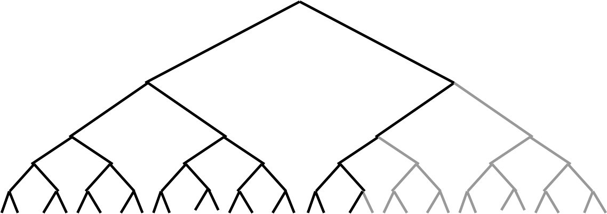
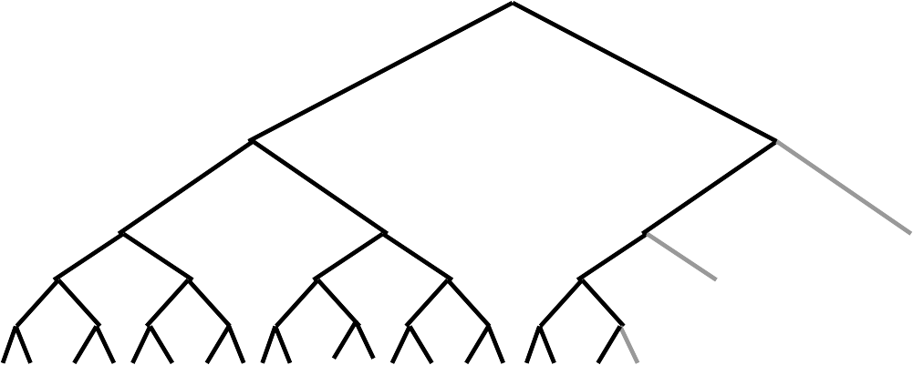
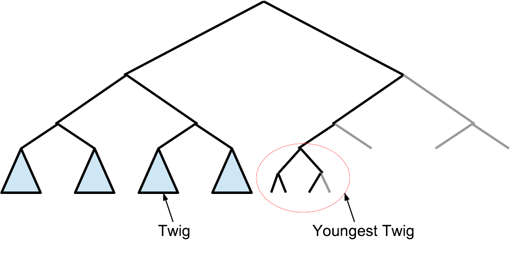
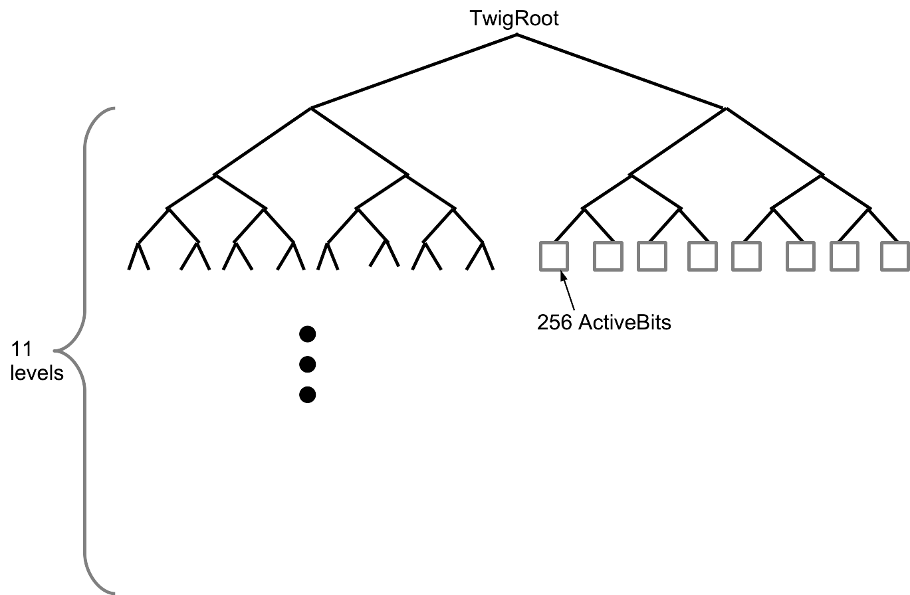
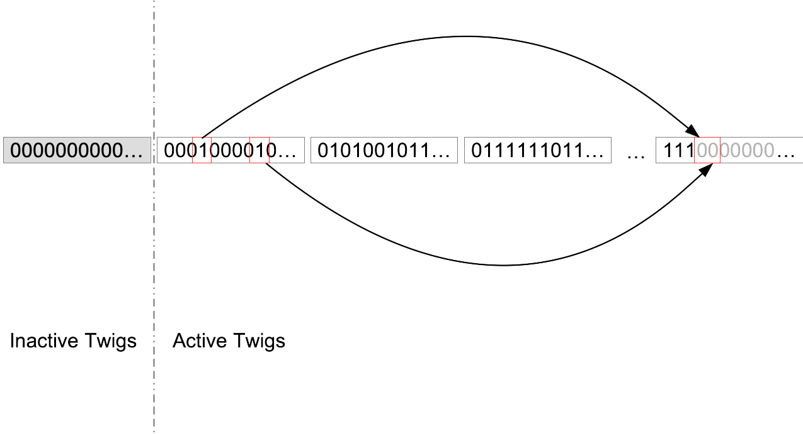
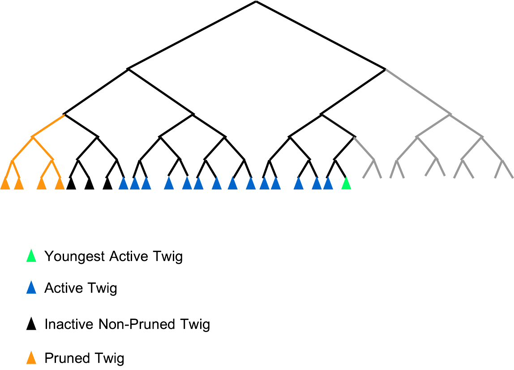

1、如何能证明一个区块链的历史上，在哪些区块上写了哪些键值对？

Entry := (Height, Key, Value, SerialNum)

把这样的Entry的Hash值一字排开，用nil填充到2的整数次幂，就可以用一个完全平衡的二叉Merkle树来证明某个高度上曾经在某个键上写入了某个值。如下图所示，灰色部分是填充的nil。

当然，在具体实现中，所谓的用nil填充到2的整数次幂，不是真的要在存储时凑够2的整数次幂个叶子，只需在每一层准备一个Dummy节点即可。如下图所示：

SerialNum表明了Entry在这个Merkle树中的位置，进行存在性证明的时候，这个值的每一个bit决定了在每一层走左边还是右边。

2、这颗Merkle树应该如何存储？

为了尽可能快地提供Proof，我们希望它完全保存在内存中，但这样太耗费内存了。Merkle树的上层被重复访问到的几率高，而下层几率低。我们可以让最下面的若干层放在磁盘上，而上层放在内存中。

目前的实现是，最下面的11层（对应2048个Entry）被放在磁盘上，如下图所示。我们把这样一颗11层的小子树称为一个Twig（图中蓝色的小三角）。最年轻的一个Twig（图中红圈里）还没有凑够2048个Entry怎么办？当然还是放在内存中。

3、如何证明某个键值对是最新的？也就是说，在那个高度之后，这个键上再也没有发生过新的事件（即对应的值没有被覆盖或者被删除）。

我们给每一个Entry附加一个ActiveBit，ActiveBit为1，则说明这个键值对是最新的；为0，则说明那个高度之后，这个键上的值曾经被覆盖或者被删除过。

ActiveBit需要随机访问，即需要将任意位置的ActiveBit清为0，因此必须把它完全放在内存中。

4、ActiveBits有必要单独做一颗Merkle树吗？

没必要，分开的两颗Merkle树会导致证明太长。更合理的实现方法是，在一个Twig当中，保存2048个ActiveBits，如下图所示。我们让Twig当中11层Entry子树的根（下图中左半部分）和3层ActiveBits子树的根（下图中右半部分）用哈希函数合并在一起形成Twig的根。

5、如何避免ActiveBits不断膨胀，占满内存？

应对措施：反复进行冗余的覆盖操作，即：把最老的键值对取出，用完全一样的值，生成一个新的Entry，再把老的ActiveBits清为0。下图展示了左边红框中的两个Entry被取出，生成了右边最新的两个Entry，这一操作完成后，左边红框里的ActiveBit将变为0，右边红框里的ActiveBits将变为1。通过这一措施，小于某个SerialNum的Entry所对应的ActiveBit就全部为0了，变成了Inactive Twigs（图中左边的部分），我们可以选择在适当时候把它们Prune掉。

6、如何进行不存在性证明？也就是说，证明在两个Key之间，不存在其他Key了。

需要在Entry中加入NextKey信息。

Entry := (Height, Key, NextKey, Value, SerialNum)

在Height之后，如果在[Key, NextKey)这个半开区间里发生一些事件，例如Key被删除了、Key对应的Value被覆盖了、一个新的键被插入到这个区间里面了，那么此Entry对应的ActiveBit一定会被清零，然后新的Entry会被创建。

7、如何证明历史上某个区块高度H时的键值对状态？如果在这个高度上，这个键值对并没有发生改变。

目前Entry中所保留的信息，足以证明在高度H之前的某个高度H0，这个键值对发生了改变，或者不存在。但是不能证明在H0和H之间，这个键值对上没有事情发生。我们需要扩展Entry的内容：

Entry := (Height, LastHeight, Key, NextKey, Value, SerialNum)

以上信息表明，在Height高度上，Key上的值是Value，而且Key和NextKey之间没有其他键值对，而且在LastHeight到Height这段时间里，在[Key, NextKey)这个半开区间里没有发生任何事件。

8、Twig如何分类？

Twig可以按照不同的角度进行分类。如下图所示

第一个角度：Youngest和非Yongest。只有一个Twig处于Youngest状态（上图中绿色的Twig），这意味着它内部的2048个Entry还没有凑齐，后面有一些是填充的nil entry。Entry是线性追加的，一旦一个Twig内部的2048个Entry到齐，它就不再是Youngest的了，会生成一个新的Twig作为Youngest。只有Youngest的Twig，才需要在内存中保留2048个Entry所对应的Merkle树，因为这棵树还处在不停的更新中。

第二个角度：Active和非Active，一个Twig，如果它内部还有至少一个ActiveBit为1，或者比它老的某一个Twig还至少有一个ActiveBit为1，那么它就是Active的，否则它就是非Active的。Youngest的Twig一定是Active的。上图中绿色和蓝色的三角形是Active Twigs。只有Active的Twig，才需要在内存中保留2048个ActiveBits及其Merkle树，因为它们还有可能发生改变。

第三个角度，Pruned和Non-Pruned，一个Twig，如果它对应的2048个Entry及其对应的Merkle树还保留在硬盘上，那么它就是Non-Prune的，否则就是Pruned。只有Inactive的Twig才谈得上是否被Prune了，Active Twigs绝不会被Prune掉。一旦被Prune掉，Entry的内容就不可被查询、不可被证明了。上图中黑色小三角是Non-Pruned Twigs，橘色小三角是Pruned Twigs。

9、如何快速访问到值？

建立索引，利用“键+高度”，定位Entry在磁盘上的位置（一个uint64整数）。

这个索引必须支持Iterator，所以只用HashTable来建立索引是不行的，必须使用树状结构。树状结构可以用红黑树（内存中）、B/B+树（内存中或者磁盘上）、LSM树（磁盘上）。为了效率，我们倾向于使用内存来保存索引。但是，也会留出使用磁盘的选项，提供给那些内存紧张的人来使用。像LevelDB、RocksDB这种磁盘存储方案，配合内存的Cache，也能实现还不错的性能。

磁盘上所保存的Entry，也可以在内存中被Cache，这样对于热点数据，就完全不用访问磁盘了。

目前的第一版实现，为了效率和内存占用考虑，只使用内存做索引，而且只能查询键值对的在最新高度的状态。未来再考虑通过基于LevelDB、RocksDB等方案，提供对历史高度的状态的查询。

10、如何剪枝？

在追加Entry的时候，记录某个高度所对应的Entry的起始SerialNum是什么。当要把某个高度之前的信息全部剪掉的时候，就把SerialNum足够小的Entry删掉，与之对应的底层Merkle树（Twig）也要删掉。

上述的索引，也需要定期进行扫描，把里面高度足够低的键值对，逐一删除。

保存Entry的文件，以及保存底层Merkle树（Twig）的文件，都需要从头部进行剪枝，文件系统无法从开头进行Truncate。因此，在实践中我们用一系列固定大小的文件来模拟一个大文件，从头部剪枝，就是删除开头的若干文件。

11、如何实现快速的状态同步？

一个新节点加入P2P网络之后，我们希望它可以从其他全节点获取所有ActiveTwig之后，就能重建出最新的状态，而不必从创世块开始执行所有区块。

为此我们进一步丰富Entry中所保存的信息：

Entry := (Height, LastHeight, Key, NextKey, Value, SerialNum, DeactivedSNList)

DeactivedSNList当中记录了一些Serial Number，这些SN指定了一些ActiveBits，在上一个Entry被创建之后、当前Entry被创建之前，这些ActiveBits被清0了。

DeactivedSNList只需要在Entry被保存在文件中时存在，而不必在内存中存在。只需要获得磁盘上所保存的、所有ActiveTwig中所保存的Entry信息，就能重建出最新状态。在网络传输的时候，为了节省带宽，还可以定义一种专门的格式，对于ActiveBit为1的Entry，传输它的完整内容，为0，则只需传输Hash值，即Merkle Root的叶子。

12、如何在Trade-Server中同步全节点的OnvaKV？

只需要在Trade-Server中随时监控Entry文件中被写入的新的Entry的内容即可。使用这些Entry中信息来更新索引、修改ActiveBits，就能让Trade-Server中的OnvaKV同跟上全节点的最新状态。在Trade-Server中，索引的存储策略，旧Twig的剪裁策略，都可以和全节点不同。
